# ChildGuard Project - System Architecture Overview

## 1. High-Level Architecture Description

ChildGuard is a comprehensive child safety and tracking system composed of three main components:
- **IoT Device (ESP32-based)**: Worn by the child, collects GPS, sound, and SOS data, communicates via MQTT.
- **Backend Server (Spring Boot, Java 17)**: Central hub for data processing, storage, security, and business logic. Integrates with MQTT broker, PostgreSQL, Redis, and push notification services.
- **Mobile App**: Used by parents/guardians to monitor, manage, and receive alerts. Communicates with backend via REST API and WebSocket for real-time updates.

Supporting services include:
- **MQTT Broker**: Real-time, lightweight messaging between IoT devices and backend.
- **PostgreSQL Database**: Secure, relational storage for all system data.

- **Firebase Cloud Messaging (FCM)**: Push notifications to mobile devices.
- **Cloud Hosting**

## 2. System Architecture Diagram

```mermaid
graph TD
  subgraph User Devices
    Mobile["📱 Mobile App (Flutter)"]
    IoT["🛰️ IoT Device (ESP32)"]
  end

  subgraph Cloud Backend
    API["🌐 Backend API (Spring Boot)"]
    DB["🗄️ PostgreSQL Database"]
  
    FCM["🔔 Firebase Cloud Messaging"]
    MQTT["🔗 MQTT Broker"]
  end

  Mobile -- REST API / WebSocket --> API
  API -- SQL --> DB
 
  API -- Push Notifications --> FCM
  API -- MQTT Subscribe/Publish --> MQTT
  IoT -- MQTT Publish/Subscribe --> MQTT
  MQTT -- Device Data --> API
  FCM -- Push --> Mobile

  classDef cloud fill:#e3f2fd,stroke:#1976d2,stroke-width:2px;
  classDef device fill:#fffde7,stroke:#fbc02d,stroke-width:2px;
  class API,DB,Redis,FCM,MQTT cloud;
  class Mobile,IoT device;
```

## 3. Component Breakdown & Interactions

### **A. IoT Device (ESP32)**
- **Sensors**: GPS, microphone, SOS button
- **Connectivity**: WiFi/BLE, MQTT protocol
- **Data Sent**: Location, sound alerts, SOS events, battery status
- **Receives**: Pairing requests, configuration updates
- **Security**: Device authentication, encrypted communication

### **B. Backend Server (Spring Boot)**
- **API Layer**: REST endpoints for mobile app, MQTT integration for IoT
- **Business Logic**: User/device management, geofencing, alert processing, analytics
- **Security**: JWT authentication, role-based access, data encryption
- **Data Storage**: PostgreSQL for persistent data, Redis for caching
- **Notifications**: Integrates with FCM for push alerts
- **Scalability**: Cloud deployment, load balancing, auto-scaling

### **C. Mobile App**
- **User Interface**: Dashboard, maps, alerts, device management
- **Communication**: REST API for data, WebSocket for real-time updates
- **Notifications**: Receives push notifications via FCM
- **Security**: Secure storage of tokens, biometric authentication
- **Offline Support**: Local caching for critical data

### **D. MQTT Broker**
- **Role**: Real-time, lightweight messaging between IoT and backend
- **Topics**: Device data, pairing, alerts
- **Security**: TLS encryption, topic access control

### **E. PostgreSQL Database**
- **Role**: Stores users, children, devices, locations, alerts, geofences, analytics
- **Security**: Row-level security, encrypted fields, regular backups

### **G. Firebase Cloud Messaging (FCM)**
- **Role**: Delivers push notifications to mobile devices
- **Integration**: Backend triggers FCM for alerts, status changes, emergencies

### **H. Cloud Hosting**
- **Role**: Scalable, reliable infrastructure for backend and services
- **Features**: Auto-scaling, monitoring, security, backup

## 4. Key Integration Points
- **IoT <-> MQTT <-> Backend**: Real-time device data and commands
- **Mobile <-> REST API/WebSocket <-> Backend**: User interaction, data visualization, real-time alerts
- **Backend <-> Database/Redis**: Data storage, caching, analytics
- **Backend <-> FCM <-> Mobile**: Push notifications for critical events

---

This architecture ensures ChildGuard is secure, scalable, and user-friendly, supporting real-time child safety monitoring and rapid emergency response. 