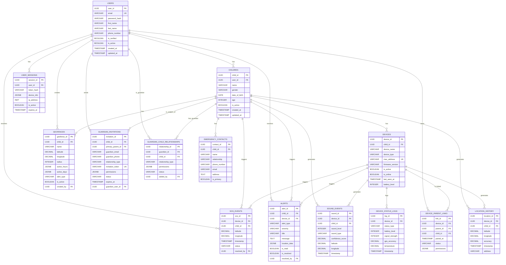

# ChildGuard Database ERD (Entity Relationship Diagram)

## 📊 Database Overview

**Database Name:** childguard_db  
**Database Type:** PostgreSQL 15+  
**Character Set:** UTF-8  
**Collation:** en_US.UTF-8  

---

## 🗂️ Database Tables

### **1. Users Table**
```sql
CREATE TABLE users (
    user_id UUID PRIMARY KEY DEFAULT gen_random_uuid(),
    email VARCHAR(255) UNIQUE NOT NULL,
    password_hash VARCHAR(255) NOT NULL,
    first_name VARCHAR(100) NOT NULL,
    last_name VARCHAR(100) NOT NULL,
    phone_number VARCHAR(20),
    is_verified BOOLEAN DEFAULT FALSE,
    is_active BOOLEAN DEFAULT TRUE,
    created_at TIMESTAMP DEFAULT NOW(),
    updated_at TIMESTAMP DEFAULT NOW(),
    last_login_at TIMESTAMP,
    profile_photo_url VARCHAR(500),
    timezone VARCHAR(50) DEFAULT 'UTC',
    language VARCHAR(10) DEFAULT 'en'
);
```

### **2. Children Table**
```sql
CREATE TABLE children (
    child_id UUID PRIMARY KEY DEFAULT gen_random_uuid(),
    user_id UUID NOT NULL REFERENCES users(user_id) ON DELETE CASCADE,
    name VARCHAR(100) NOT NULL,
    gender VARCHAR(10) CHECK (gender IN ('male', 'female', 'other')),
    date_of_birth DATE,
    age INTEGER GENERATED ALWAYS AS (EXTRACT(YEAR FROM AGE(date_of_birth))) STORED,
    is_active BOOLEAN DEFAULT TRUE,
    created_at TIMESTAMP DEFAULT NOW(),
    updated_at TIMESTAMP DEFAULT NOW(),
    profile_photo_url VARCHAR(500),
    emergency_contacts JSONB,
    medical_info JSONB,
    school_info JSONB
);
```

### **3. Devices Table**
```sql
CREATE TABLE devices (
    device_id UUID PRIMARY KEY DEFAULT gen_random_uuid(),
    child_id UUID REFERENCES children(child_id) ON DELETE SET NULL,
    device_name VARCHAR(100) NOT NULL,
    device_type VARCHAR(50) DEFAULT 'ESP32',
    mac_address VARCHAR(17) UNIQUE,
    firmware_version VARCHAR(20),
    hardware_version VARCHAR(20),
    is_active BOOLEAN DEFAULT TRUE,
    is_online BOOLEAN DEFAULT FALSE,
    last_seen_at TIMESTAMP,
    created_at TIMESTAMP DEFAULT NOW(),
    updated_at TIMESTAMP DEFAULT NOW(),
    device_config JSONB,
    battery_level INTEGER CHECK (battery_level >= 0 AND battery_level <= 100),
    signal_strength INTEGER,
    gps_accuracy DECIMAL(5,2)
);
```

### **4. Device_Parent_Links Table**
```sql
CREATE TABLE device_parent_links (
    link_id UUID PRIMARY KEY DEFAULT gen_random_uuid(),
    device_id UUID NOT NULL REFERENCES devices(device_id) ON DELETE CASCADE,
    parent_id UUID NOT NULL REFERENCES users(user_id) ON DELETE CASCADE,
    child_id UUID NOT NULL REFERENCES children(child_id) ON DELETE CASCADE,
    paired_at TIMESTAMP DEFAULT NOW(),
    status VARCHAR(20) DEFAULT 'active' CHECK (status IN ('active', 'inactive', 'pending')),
    permissions JSONB DEFAULT '{"location": true, "alerts": true, "history": true}',
    UNIQUE(device_id, parent_id)
);
```

### **5. Location_History Table**
```sql
CREATE TABLE location_history (
    location_id UUID PRIMARY KEY DEFAULT gen_random_uuid(),
    device_id UUID NOT NULL REFERENCES devices(device_id) ON DELETE CASCADE,
    child_id UUID NOT NULL REFERENCES children(child_id) ON DELETE CASCADE,
    latitude DECIMAL(10, 8) NOT NULL,
    longitude DECIMAL(11, 8) NOT NULL,
    accuracy DECIMAL(5, 2),
    altitude DECIMAL(8, 2),
    speed DECIMAL(5, 2),
    heading INTEGER,
    timestamp TIMESTAMP NOT NULL,
    address VARCHAR(500),
    location_type VARCHAR(50),
    created_at TIMESTAMP DEFAULT NOW()
);
```

### **6. Geofences Table**
```sql
CREATE TABLE geofences (
    geofence_id UUID PRIMARY KEY DEFAULT gen_random_uuid(),
    child_id UUID NOT NULL REFERENCES children(child_id) ON DELETE CASCADE,
    name VARCHAR(100) NOT NULL,
    description TEXT,
    latitude DECIMAL(10, 8) NOT NULL,
    longitude DECIMAL(11, 8) NOT NULL,
    radius INTEGER NOT NULL CHECK (radius > 0),
    active_hours JSONB,
    active_days JSONB,
    alert_type VARCHAR(20) DEFAULT 'leave' CHECK (alert_type IN ('enter', 'leave', 'both')),
    is_active BOOLEAN DEFAULT TRUE,
    created_at TIMESTAMP DEFAULT NOW(),
    updated_at TIMESTAMP DEFAULT NOW(),
    created_by UUID NOT NULL REFERENCES users(user_id)
);
```

### **7. Alerts Table**
```sql
CREATE TABLE alerts (
    alert_id UUID PRIMARY KEY DEFAULT gen_random_uuid(),
    child_id UUID NOT NULL REFERENCES children(child_id) ON DELETE CASCADE,
    device_id UUID REFERENCES devices(device_id) ON DELETE SET NULL,
    alert_type VARCHAR(50) NOT NULL CHECK (alert_type IN ('SOS', 'geofence_violation', 'sound_detection', 'device_offline', 'battery_low', 'location_anomaly')),
    severity VARCHAR(20) DEFAULT 'medium' CHECK (severity IN ('low', 'medium', 'high', 'critical')),
    title VARCHAR(200) NOT NULL,
    message TEXT,
    location_data JSONB,
    metadata JSONB,
    is_read BOOLEAN DEFAULT FALSE,
    is_resolved BOOLEAN DEFAULT FALSE,
    resolved_at TIMESTAMP,
    resolved_by UUID REFERENCES users(user_id),
    created_at TIMESTAMP DEFAULT NOW(),
    updated_at TIMESTAMP DEFAULT NOW()
);
```

### **8. Alert_Recipients Table**
```sql
CREATE TABLE alert_recipients (
    recipient_id UUID PRIMARY KEY DEFAULT gen_random_uuid(),
    alert_id UUID NOT NULL REFERENCES alerts(alert_id) ON DELETE CASCADE,
    user_id UUID NOT NULL REFERENCES users(user_id) ON DELETE CASCADE,
    notification_method VARCHAR(20) NOT NULL CHECK (notification_method IN ('push', 'email', 'sms', 'phone')),
    sent_at TIMESTAMP,
    delivered_at TIMESTAMP,
    read_at TIMESTAMP,
    status VARCHAR(20) DEFAULT 'pending' CHECK (status IN ('pending', 'sent', 'delivered', 'read', 'failed')),
    UNIQUE(alert_id, user_id, notification_method)
);
```

### **9. SOS_Events Table**
```sql
CREATE TABLE sos_events (
    sos_id UUID PRIMARY KEY DEFAULT gen_random_uuid(),
    device_id UUID NOT NULL REFERENCES devices(device_id) ON DELETE CASCADE,
    child_id UUID NOT NULL REFERENCES children(child_id) ON DELETE CASCADE,
    latitude DECIMAL(10, 8) NOT NULL,
    longitude DECIMAL(11, 8) NOT NULL,
    accuracy DECIMAL(5, 2),
    timestamp TIMESTAMP NOT NULL,
    status VARCHAR(20) DEFAULT 'active' CHECK (status IN ('active', 'resolved', 'false_alarm')),
    resolved_at TIMESTAMP,
    resolved_by UUID REFERENCES users(user_id),
    resolution_notes TEXT,
    created_at TIMESTAMP DEFAULT NOW()
);
```

### **10. Sound_Events Table**
```sql
CREATE TABLE sound_events (
    sound_id UUID PRIMARY KEY DEFAULT gen_random_uuid(),
    device_id UUID NOT NULL REFERENCES devices(device_id) ON DELETE CASCADE,
    child_id UUID NOT NULL REFERENCES children(child_id) ON DELETE CASCADE,
    sound_level INTEGER NOT NULL,
    sound_type VARCHAR(50),
    confidence_score DECIMAL(3, 2) CHECK (confidence_score >= 0 AND confidence_score <= 1),
    latitude DECIMAL(10, 8),
    longitude DECIMAL(11, 8),
    timestamp TIMESTAMP NOT NULL,
    audio_file_url VARCHAR(500),
    is_alert_generated BOOLEAN DEFAULT FALSE,
    created_at TIMESTAMP DEFAULT NOW()
);
```

### **11. Guardian_Invitations Table**
```sql
CREATE TABLE guardian_invitations (
    invitation_id UUID PRIMARY KEY DEFAULT gen_random_uuid(),
    child_id UUID NOT NULL REFERENCES children(child_id) ON DELETE CASCADE,
    primary_parent_id UUID NOT NULL REFERENCES users(user_id) ON DELETE CASCADE,
    guardian_email VARCHAR(255),
    guardian_phone VARCHAR(20),
    relationship_type VARCHAR(50) NOT NULL,
    invitation_token VARCHAR(100) UNIQUE NOT NULL,
    permissions JSONB NOT NULL,
    status VARCHAR(20) DEFAULT 'PENDING' CHECK (status IN ('PENDING', 'ACCEPTED', 'EXPIRED', 'CANCELLED')),
    expires_at TIMESTAMP NOT NULL,
    created_at TIMESTAMP DEFAULT NOW(),
    accepted_at TIMESTAMP,
    guardian_user_id UUID REFERENCES users(user_id)
);
```

### **12. Guardian_Child_Relationships Table**
```sql
CREATE TABLE guardian_child_relationships (
    relationship_id UUID PRIMARY KEY DEFAULT gen_random_uuid(),
    guardian_id UUID NOT NULL REFERENCES users(user_id) ON DELETE CASCADE,
    child_id UUID NOT NULL REFERENCES children(child_id) ON DELETE CASCADE,
    relationship_type VARCHAR(50) NOT NULL,
    permissions JSONB NOT NULL,
    status VARCHAR(20) DEFAULT 'ACTIVE' CHECK (status IN ('ACTIVE', 'INACTIVE', 'SUSPENDED')),
    added_by UUID NOT NULL REFERENCES users(user_id),
    added_at TIMESTAMP DEFAULT NOW(),
    last_access_at TIMESTAMP,
    UNIQUE(guardian_id, child_id)
);
```

### **13. Guardian_Notifications Table**
```sql
CREATE TABLE guardian_notifications (
    notification_id UUID PRIMARY KEY DEFAULT gen_random_uuid(),
    guardian_id UUID NOT NULL REFERENCES users(user_id) ON DELETE CASCADE,
    child_id UUID NOT NULL REFERENCES children(child_id) ON DELETE CASCADE,
    alert_type VARCHAR(50) NOT NULL,
    notification_method VARCHAR(20) NOT NULL CHECK (notification_method IN ('push', 'email', 'sms', 'phone')),
    is_enabled BOOLEAN DEFAULT TRUE,
    quiet_hours_start TIME,
    quiet_hours_end TIME,
    priority_level INTEGER DEFAULT 1 CHECK (priority_level >= 1 AND priority_level <= 5),
    created_at TIMESTAMP DEFAULT NOW(),
    UNIQUE(guardian_id, child_id, alert_type, notification_method)
);
```

### **14. Emergency_Contacts Table**
```sql
CREATE TABLE emergency_contacts (
    contact_id UUID PRIMARY KEY DEFAULT gen_random_uuid(),
    child_id UUID NOT NULL REFERENCES children(child_id) ON DELETE CASCADE,
    name VARCHAR(100) NOT NULL,
    relationship VARCHAR(50),
    phone_number VARCHAR(20) NOT NULL,
    email VARCHAR(255),
    address TEXT,
    is_primary BOOLEAN DEFAULT FALSE,
    notification_preferences JSONB,
    created_at TIMESTAMP DEFAULT NOW(),
    updated_at TIMESTAMP DEFAULT NOW()
);
```

### **15. Device_Status_Logs Table**
```sql
CREATE TABLE device_status_logs (
    log_id UUID PRIMARY KEY DEFAULT gen_random_uuid(),
    device_id UUID NOT NULL REFERENCES devices(device_id) ON DELETE CASCADE,
    status_type VARCHAR(50) NOT NULL CHECK (status_type IN ('online', 'offline', 'battery_low', 'signal_weak', 'gps_error')),
    battery_level INTEGER CHECK (battery_level >= 0 AND battery_level <= 100),
    signal_strength INTEGER,
    gps_accuracy DECIMAL(5, 2),
    temperature DECIMAL(4, 1),
    metadata JSONB,
    timestamp TIMESTAMP NOT NULL,
    created_at TIMESTAMP DEFAULT NOW()
);
```

### **16. User_Sessions Table**
```sql
CREATE TABLE user_sessions (
    session_id UUID PRIMARY KEY DEFAULT gen_random_uuid(),
    user_id UUID NOT NULL REFERENCES users(user_id) ON DELETE CASCADE,
    token_hash VARCHAR(255) NOT NULL,
    device_info JSONB,
    ip_address INET,
    user_agent TEXT,
    is_active BOOLEAN DEFAULT TRUE,
    created_at TIMESTAMP DEFAULT NOW(),
    expires_at TIMESTAMP NOT NULL,
    last_activity_at TIMESTAMP DEFAULT NOW()
);
```

---

## 🔗 Entity Relationship Diagram



---

## 📋 Database Indexes

### **Performance Indexes:**
```sql
-- Location History Indexes
CREATE INDEX idx_location_history_device_timestamp ON location_history(device_id, timestamp DESC);
CREATE INDEX idx_location_history_child_timestamp ON location_history(child_id, timestamp DESC);
CREATE INDEX idx_location_history_coordinates ON location_history(latitude, longitude);

-- Alert Indexes
CREATE INDEX idx_alerts_child_created ON alerts(child_id, created_at DESC);
CREATE INDEX idx_alerts_type_status ON alerts(alert_type, is_resolved);
CREATE INDEX idx_alerts_device_timestamp ON alerts(device_id, created_at DESC);

-- Device Indexes
CREATE INDEX idx_devices_child_status ON devices(child_id, is_active, is_online);
CREATE INDEX idx_devices_last_seen ON devices(last_seen_at DESC);
CREATE INDEX idx_devices_battery ON devices(battery_level) WHERE battery_level < 20;

-- Geofence Indexes
CREATE INDEX idx_geofences_child_active ON geofences(child_id, is_active);
CREATE INDEX idx_geofences_coordinates ON geofences(latitude, longitude);

-- User Session Indexes
CREATE INDEX idx_user_sessions_user_active ON user_sessions(user_id, is_active);
CREATE INDEX idx_user_sessions_expires ON user_sessions(expires_at) WHERE is_active = true;

-- Guardian Relationship Indexes
CREATE INDEX idx_guardian_relationships_guardian ON guardian_child_relationships(guardian_id, status);
CREATE INDEX idx_guardian_relationships_child ON guardian_child_relationships(child_id, status);
```

---

## 🔒 Security Features

### **Row Level Security (RLS):**
```sql
-- Enable RLS on sensitive tables
ALTER TABLE children ENABLE ROW LEVEL SECURITY;
ALTER TABLE location_history ENABLE ROW LEVEL SECURITY;
ALTER TABLE alerts ENABLE ROW LEVEL SECURITY;
ALTER TABLE devices ENABLE ROW LEVEL SECURITY;

-- RLS Policies
CREATE POLICY "Users can only see their own children" ON children
    FOR ALL USING (user_id = current_user_id());

CREATE POLICY "Users can only see their children's location history" ON location_history
    FOR ALL USING (child_id IN (
        SELECT child_id FROM children WHERE user_id = current_user_id()
    ));

CREATE POLICY "Users can only see their children's alerts" ON alerts
    FOR ALL USING (child_id IN (
        SELECT child_id FROM children WHERE user_id = current_user_id()
    ));
```

### **Data Encryption:**
```sql
-- Enable pgcrypto extension
CREATE EXTENSION IF NOT EXISTS pgcrypto;

-- Encrypt sensitive data
UPDATE users SET 
    phone_number = pgp_sym_encrypt(phone_number, 'encryption_key'),
    password_hash = crypt(password_hash, gen_salt('bf'));
```

---

## 📊 Database Views

### **Child Dashboard View:**
```sql
CREATE VIEW child_dashboard AS
SELECT 
    c.child_id,
    c.name,
    c.age,
    d.device_id,
    d.device_name,
    d.is_online,
    d.battery_level,
    d.last_seen_at,
    lh.latitude,
    lh.longitude,
    lh.address,
    lh.timestamp as last_location_time,
    COUNT(a.alert_id) as unread_alerts
FROM children c
LEFT JOIN devices d ON c.child_id = d.child_id
LEFT JOIN location_history lh ON d.device_id = lh.device_id
LEFT JOIN alerts a ON c.child_id = a.child_id AND a.is_read = false
WHERE c.is_active = true
GROUP BY c.child_id, c.name, c.age, d.device_id, d.device_name, 
         d.is_online, d.battery_level, d.last_seen_at, 
         lh.latitude, lh.longitude, lh.address, lh.timestamp;
```

### **Alert Summary View:**
```sql
CREATE VIEW alert_summary AS
SELECT 
    child_id,
    alert_type,
    severity,
    COUNT(*) as alert_count,
    COUNT(*) FILTER (WHERE is_resolved = true) as resolved_count,
    COUNT(*) FILTER (WHERE is_read = false) as unread_count,
    MIN(created_at) as first_alert,
    MAX(created_at) as last_alert
FROM alerts
GROUP BY child_id, alert_type, severity;
```

---

## 🔄 Database Triggers

### **Update Timestamps:**
```sql
CREATE OR REPLACE FUNCTION update_updated_at_column()
RETURNS TRIGGER AS $$
BEGIN
    NEW.updated_at = NOW();
    RETURN NEW;
END;
$$ language 'plpgsql';

CREATE TRIGGER update_users_updated_at BEFORE UPDATE ON users
    FOR EACH ROW EXECUTE FUNCTION update_updated_at_column();

CREATE TRIGGER update_children_updated_at BEFORE UPDATE ON children
    FOR EACH ROW EXECUTE FUNCTION update_updated_at_column();

CREATE TRIGGER update_devices_updated_at BEFORE UPDATE ON devices
    FOR EACH ROW EXECUTE FUNCTION update_updated_at_column();
```

### **Alert Generation:**
```sql
CREATE OR REPLACE FUNCTION generate_geofence_alert()
RETURNS TRIGGER AS $$
BEGIN
    -- Check if location violates any geofences
    INSERT INTO alerts (child_id, device_id, alert_type, severity, title, message, location_data)
    SELECT 
        NEW.child_id,
        NEW.device_id,
        'geofence_violation',
        'medium',
        'Geofence Violation',
        'Child has left the safe zone: ' || g.name,
        jsonb_build_object(
            'latitude', NEW.latitude,
            'longitude', NEW.longitude,
            'geofence_id', g.geofence_id,
            'geofence_name', g.name
        )
    FROM geofences g
    WHERE g.child_id = NEW.child_id 
    AND g.is_active = true
    AND g.alert_type IN ('leave', 'both')
    AND ST_DWithin(
        ST_MakePoint(NEW.longitude, NEW.latitude)::geography,
        ST_MakePoint(g.longitude, g.latitude)::geography,
        g.radius
    ) = false;
    
    RETURN NEW;
END;
$$ language 'plpgsql';

CREATE TRIGGER location_geofence_check AFTER INSERT ON location_history
    FOR EACH ROW EXECUTE FUNCTION generate_geofence_alert();
```

---

## 📈 Database Statistics

### **Table Sizes:**
- **Users:** ~1,000 records (small)
- **Children:** ~1,500 records (small)
- **Devices:** ~1,500 records (small)
- **Location History:** ~10M+ records (large, time-series)
- **Alerts:** ~100K records (medium)
- **Geofences:** ~5,000 records (small)

### **Storage Requirements:**
- **Total Estimated Size:** ~50GB (with 1 year of data)
- **Monthly Growth:** ~5GB
- **Backup Size:** ~10GB (compressed)

---

## 🚀 Database Optimization

### **Partitioning Strategy:**
```sql
-- Partition location_history by month
CREATE TABLE location_history_y2024m01 PARTITION OF location_history
FOR VALUES FROM ('2024-01-01') TO ('2024-02-01');

CREATE TABLE location_history_y2024m02 PARTITION OF location_history
FOR VALUES FROM ('2024-02-01') TO ('2024-03-01');
```

### **Materialized Views:**
```sql
-- Daily location summary
CREATE MATERIALIZED VIEW daily_location_summary AS
SELECT 
    child_id,
    DATE(timestamp) as date,
    COUNT(*) as location_points,
    AVG(accuracy) as avg_accuracy,
    MIN(timestamp) as first_location,
    MAX(timestamp) as last_location
FROM location_history
GROUP BY child_id, DATE(timestamp);

-- Refresh daily
REFRESH MATERIALIZED VIEW daily_location_summary;
```

---

This comprehensive ERD provides a complete database schema for the ChildGuard graduation project with all necessary tables, relationships, constraints, and optimization strategies. 