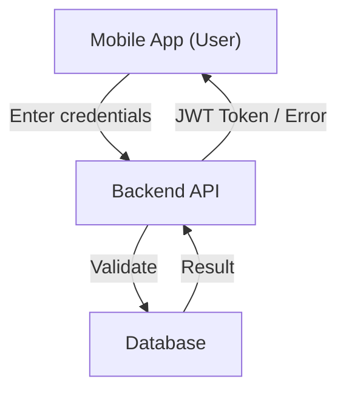
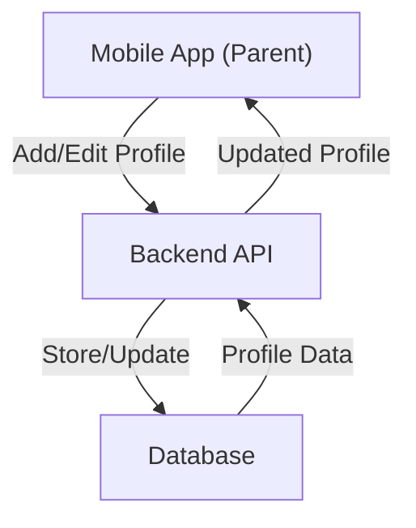
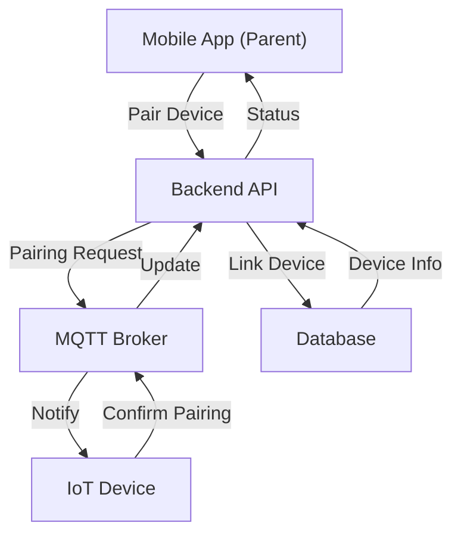
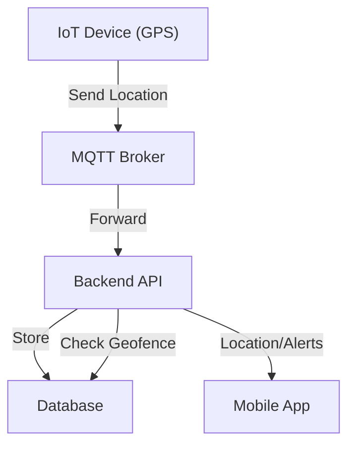
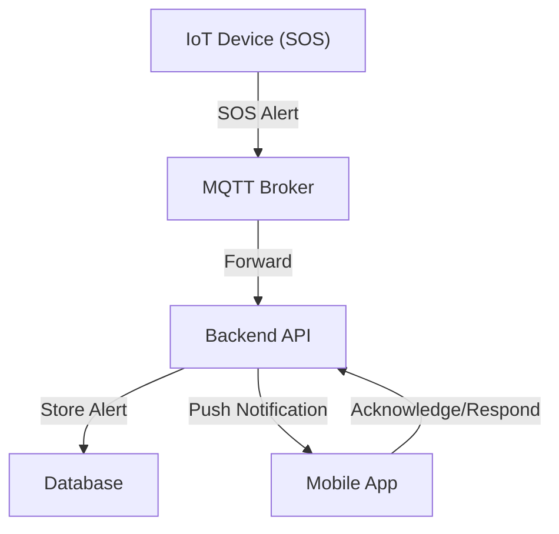
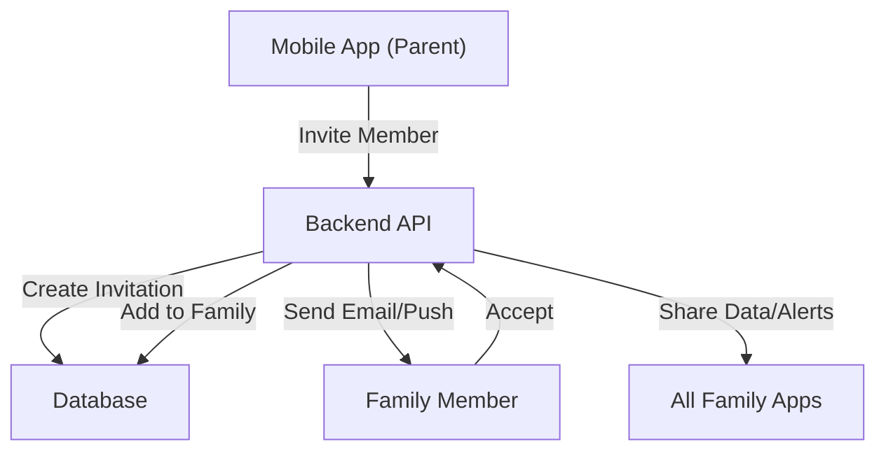
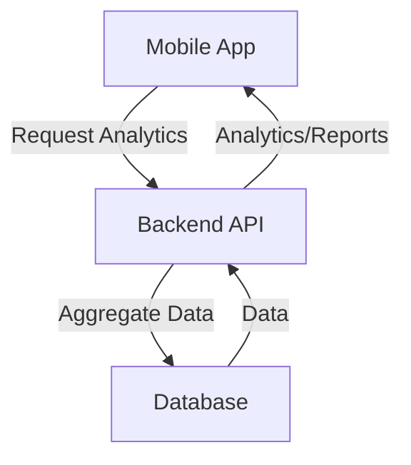
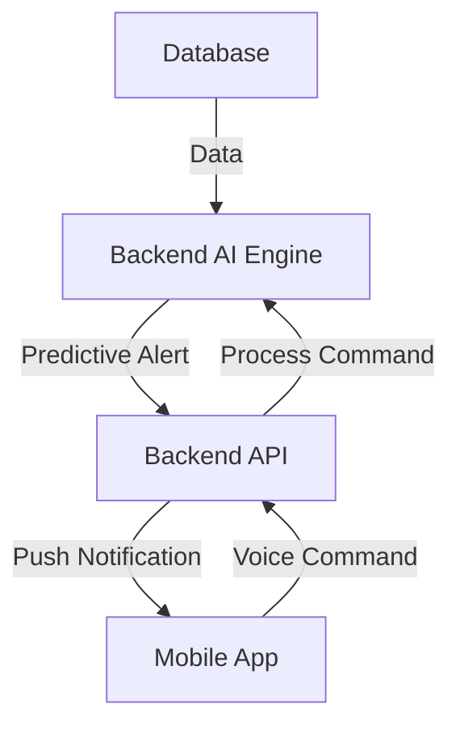

# ChildGuard Project - Feature Data Flow Diagrams

## Table of Contents
1. [User Authentication & Management](#user-authentication--management)
2. [Child Profile Management](#child-profile-management)
3. [Device Pairing & Management](#device-pairing--management)
4. [Location Tracking & Geofencing](#location-tracking--geofencing)
5. [SOS Emergency System](#sos-emergency-system)
6. [Sound Detection & Alerts](#sound-detection--alerts)
7. [Family Management & Sharing](#family-management--sharing)
8. [Analytics & Reporting](#analytics--reporting)
9. [Advanced Features](#advanced-features)

---

## 1. User Authentication & Management

**Data Flow Description:**
- The user opens the mobile app and submits login or registration data.
- The app sends credentials to the backend via REST API.
- The backend validates credentials, checks the database, and returns a JWT token if successful.
- The mobile app stores the token for future requests.

---

## 2. Child Profile Management

**Data Flow Description:**
- Parent adds or edits a child profile in the mobile app.
- The app sends profile data (name, age, photo) to the backend.
- The backend stores/updates the child profile in the database.
- The app fetches and displays updated child profiles.

---

## 3. Device Pairing & Management

**Data Flow Description:**
- Parent initiates device pairing in the app (scans QR code or enters device ID).
- The app sends pairing request to the backend.
- The backend creates a pairing session and notifies the IoT device via MQTT.
- The IoT device confirms pairing and updates its status.
- The backend links the device to the child/parent in the database.
- The app displays the paired device status.

---

## 4. Location Tracking & Geofencing

**Data Flow Description:**
- The IoT device collects GPS data and sends it to the backend via MQTT.
- The backend processes and stores location data in the database.
- The backend checks for geofence violations.
- The mobile app fetches real-time location and geofence alerts from the backend.

---

## 5. SOS Emergency System

**Data Flow Description:**
- Child presses the SOS button on the IoT device.
- The device sends an SOS alert via MQTT to the backend.
- The backend stores the alert, notifies all linked parents/guardians via push notification, and updates the alert status in the database.
- The mobile app receives the alert and displays emergency options.

---

## 6. Sound Detection & Alerts

**Data Flow Description:**
- The IoT device monitors sound levels and detects abnormal noise.
- When a threshold is exceeded, the device sends a sound alert via MQTT.
- The backend processes and stores the alert, then notifies the parent’s mobile app.
- The parent can view sound alert details and respond.

---

## 7. Family Management & Sharing

**Data Flow Description:**
- Parent invites family members via the mobile app.
- The app sends invitation data to the backend.
- The backend creates an invitation and sends an email or push notification to the invitee.
- The invitee accepts and is added to the family group in the database.
- All family members receive relevant alerts and can view shared data.

---

## 8. Analytics & Reporting

**Data Flow Description:**
- The backend aggregates data (location, alerts, activity) from the database.
- The mobile app requests analytics or reports.
- The backend processes and returns analytics data to the app for visualization.

---

## 9. Advanced Features (AI, Voice, Predictive Alerts)

**Data Flow Description:**
- The backend uses AI models to analyze data from the database (location, sound, activity).
- When a risk or anomaly is detected, the backend sends a predictive alert to the mobile app.
- The app can also send voice commands to the backend for processing.

---

This file provides a clear, visual, and textual explanation of the data flow for each major feature in the ChildGuard project, making it easy for your team and stakeholders to understand how each part of the system works. 