# ChildGuard Feature-by-Feature Explanation

This document explains each major feature of the ChildGuard system for your team. For each feature, you'll find:
- **Feature Name**
- **Description** (what it is, why it matters)
- **How It Works** 
- **Data Flow Diagram**

---

## 1. User Registration

**Description:**
Allows a parent to create a new account in the system. This is the first step for any user to access the app and manage their children/devices.

**How It Works:**
1. Parent opens the app and fills out the registration form.
2. The app sends the registration data to the backend via REST API.
3. The backend creates a new user in the database and sends a verification email.
4. The parent receives a verification link or code to activate their account.
5. The app notifies the parent of successful registration and next steps.

**Data Flow:**
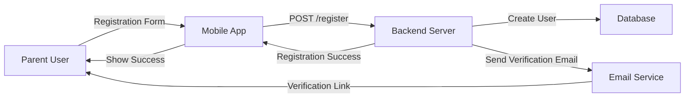

---

## 2. User Login/Authentication

**Description:**
Allows a parent to securely log in to the app using their credentials. Ensures only authorized users can access sensitive data.

**How It Works:**
1. Parent enters email and password in the app.
2. The app sends login credentials to the backend via REST API.
3. The backend verifies credentials against the database.
4. If valid, the backend returns a JWT token for secure access.
5. The app stores the token and grants access to features.

**Data Flow:**
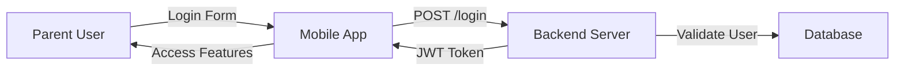

---

## 3. Device Pairing

**Description:**
Links a child's IoT device (ESP32) to the parent's account using a secure pairing process. The IoT device displays a unique QR code that the parent scans using the mobile app's camera.

**How It Works:**
1. Parent opens the mobile app and navigates to the "Add Device" or "Pair Device" section.
2. Parent selects "Pair New Device" and chooses the child to associate with the device.
3. The mobile app activates its camera for QR code scanning.
4. The IoT device displays its unique QR code (containing device ID, pairing token, and device information) on its built-in display or LED screen.
5. Parent positions the mobile app's camera to scan the QR code displayed on the IoT device.
6. The mobile app's camera captures the QR code and extracts the device ID, pairing token, and device information.
7. The mobile app sends the pairing request with extracted device data to the backend server via REST API.
8. The backend validates the device ID and pairing token against the database.
9. The backend creates a pairing session and links the device to the child/parent account in the database.
10. The backend sends a confirmation to the IoT device via MQTT to complete the pairing process.
11. The IoT device confirms successful pairing and updates its status.
12. The backend notifies the mobile app of successful pairing completion.
13. The mobile app displays a success message and shows the newly paired device in the device list.
14. The parent can now monitor the child through the paired IoT device.

**Data Flow:**
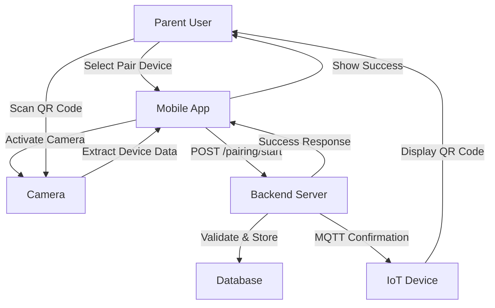

---

## 4. Real-Time Location Tracking

**Description:**
Tracks the child's location in real time using the IoT device's GPS and displays it on the parent's mobile app.

**How It Works:**
1. The IoT device collects GPS data.
2. It sends location updates to the backend via MQTT.
3. The backend stores the location in the database.
4. The parent's app requests or receives real-time updates via REST API or WebSocket.
5. The app displays the child's location on a map.

**Data Flow:**
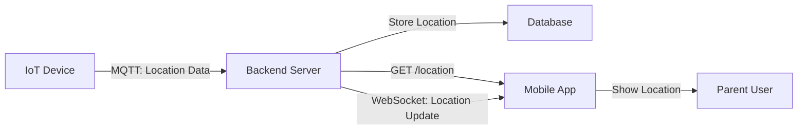

---

## 5. Geofence Management & Violation Alert

**Description:**
Lets parents set safe zones (geofences) for their child. If the child leaves the zone, the system sends an alert.

**How It Works:**
1. Parent sets or updates geofences in the app.
2. The app sends geofence data to the backend.
3. The backend stores geofences in the database.
4. The backend checks each location update against geofences.
5. If a violation is detected, an alert is generated and sent to the parent.

**Data Flow:**
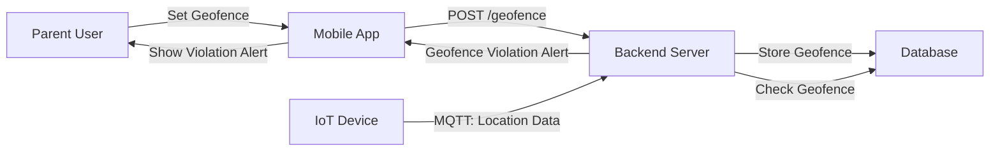

---

## 6. SOS Emergency Alert

**Description:**
Allows a child to send an emergency SOS alert by pressing a button on the device. The parent and (optionally) emergency services are notified immediately.

**How It Works:**
1. Child presses the SOS button on the device.
2. The device sends an SOS event to the backend via MQTT.
3. The backend stores the event and generates an alert.
4. The backend sends a push notification to the parent's app (and optionally notifies emergency services).
5. The parent receives and responds to the alert.

**Data Flow:**
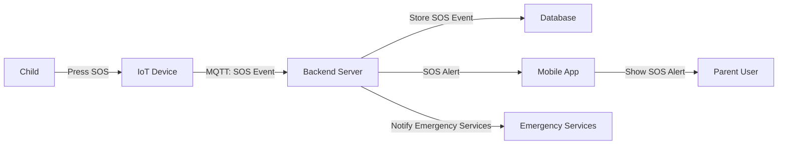

---

## 7. Sound Detection & Alert

**Description:**
Detects unusual or dangerous sounds (e.g., loud noises, crying) using the device's microphone and notifies the parent.

**How It Works:**
1. The IoT device captures sound using its microphone.
2. It analyzes or sends sound data to the backend via MQTT.
3. The backend processes the sound event and stores it in the database.
4. If a dangerous sound is detected, the backend generates an alert.
5. The parent receives a push notification and can review the alert in the app.

**Data Flow:**
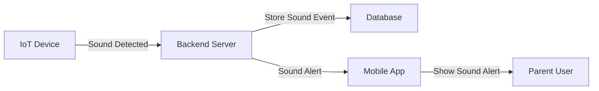

---

## 8. Push Notification Delivery

**Description:**
Delivers real-time alerts and updates to the parent's mobile app using Firebase Cloud Messaging (FCM).

**How It Works:**
1. The backend generates a notification (for alerts, status, etc.).
2. The backend sends the notification to FCM.
3. FCM delivers the push notification to the parent's mobile app.
4. The app displays the notification to the user.

**Data Flow:**
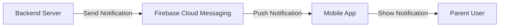

---

## 9. View Location History

**Description:**
Allows parents to view a history of their child's past locations on a map for safety review and tracking.

**How It Works:**
1. Parent requests location history in the app.
2. The app sends a request to the backend via REST API.
3. The backend retrieves location history from the database.
4. The app displays the history to the parent.

**Data Flow:**
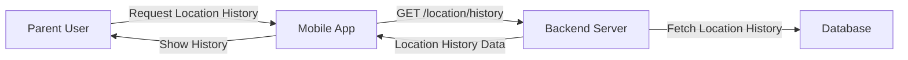

---

## 10. BLE Proximity Detection

**Description:**
Uses Bluetooth Low Energy (BLE) to detect if the parent's phone is near the child's device, useful for indoor or close-range tracking.

**How It Works:**
1. The IoT device broadcasts a BLE signal.
2. The parent's mobile app scans for BLE signals.
3. If the device is nearby, the app notifies the parent.

**Data Flow:**
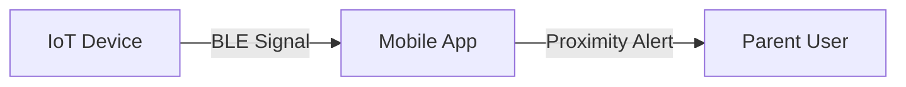

---

## 11. Alert Management

**Description:**
Lets parents view, acknowledge, and resolve alerts (e.g., geofence, SOS, sound) in the app.

**How It Works:**
1. The backend generates and stores alerts in the database.
2. The parent views alerts in the app.
3. The parent can acknowledge or resolve alerts.
4. The app sends alert actions to the backend, which updates the database and notifies the parent.

**Data Flow:**
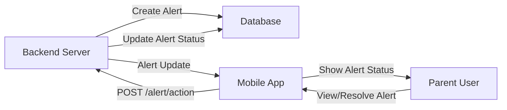

---

## 12. Device Status Monitoring

**Description:**
Monitors the status of the child's device (battery, connectivity, last seen) and displays it to the parent.

**How It Works:**
1. The IoT device periodically sends status updates to the backend via MQTT.
2. The backend stores device status in the database.
3. The parent's app requests device status via REST API.
4. The app displays the device status to the parent.

**Data Flow:**
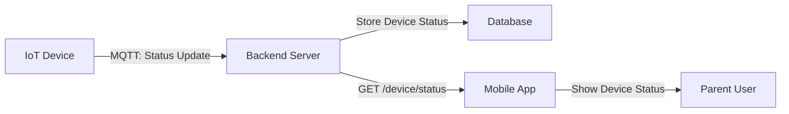

---

## 13. Multi-Parent Support

**Description:**
Allows more than one parent/guardian per child, enabling shared responsibility and access to child monitoring.

**How It Works:**
1. Primary parent invites additional guardians via email or phone.
2. Invited guardians receive an invitation link or code.
3. Guardians register and accept the invitation.
4. All guardians can access the child's monitoring data and alerts.
5. Each guardian can set their own preferences and notification settings.

**Data Flow:**
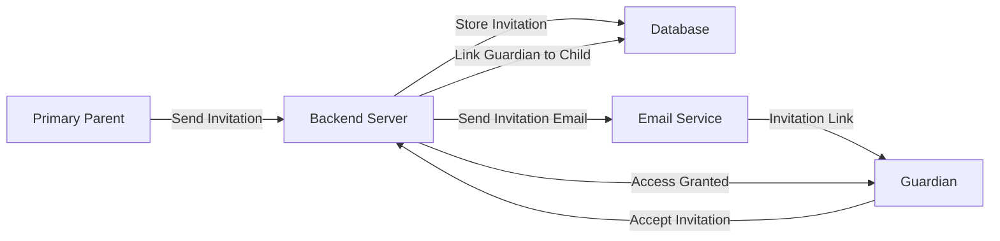

---

## 14. Voice Command Integration

**Description:**
Allows parents to use voice commands to control the app and receive voice-based alerts and updates.

**How It Works:**
1. Parent enables voice commands in app settings.
2. App integrates with device's speech recognition capabilities.
3. Parent can use voice commands for common actions (check location, view alerts).
4. App can provide voice-based alerts and status updates.
5. Voice commands work hands-free for safety and convenience.

**Data Flow:**
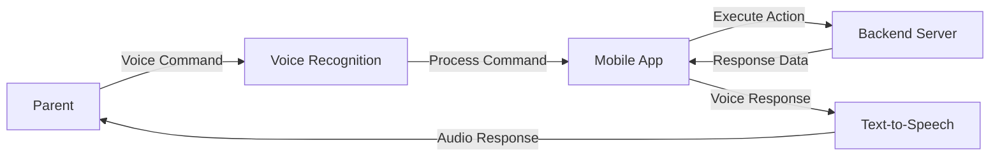

---
---

## 15. Location Sharing with Emergency Contacts

**Description:**
Extends location sharing beyond parents to include emergency contacts, providing additional safety coverage.

**How It Works:**
1. Parent adds emergency contacts (family members, trusted friends) to the system.
2. Emergency contacts receive access permissions and notifications.
3. During emergencies or alerts, location data is shared with emergency contacts.
4. Emergency contacts can view real-time location and respond to alerts.
5. Parent controls what information is shared and with whom.

**Data Flow:**
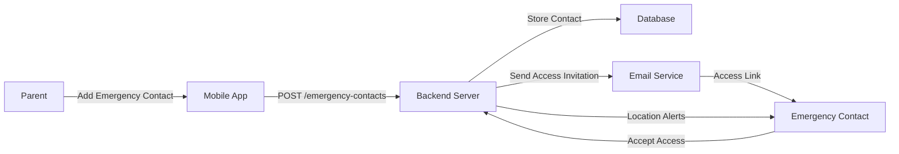

---

## 16. Analytics & Statistics

**Description:**
Provides detailed analytics and statistics about child safety patterns, device usage, and alert frequency.

**How It Works:**
1. System collects and analyzes data from all monitoring activities.
2. Analytics engine processes location data, alert patterns, and device usage.
3. Parents can view statistics like time spent in/out of geofence, alert frequency.
4. Reports can be generated for daily, weekly, or monthly periods.
5. Insights help parents understand safety patterns and optimize monitoring.

**Data Flow:**
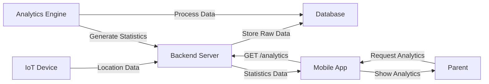

---

## 17. Emergency Services Integration

**Description:**
Integrates with external emergency services to automatically send SMS/call alerts during critical situations.

**How It Works:**
1. Parent configures emergency service integration settings.
2. During SOS events, system automatically contacts emergency services.
3. Emergency services receive location data, child information, and alert details.
4. System can initiate emergency calls or send SMS with critical information.
5. Emergency services can respond directly to the situation.

**Data Flow:**
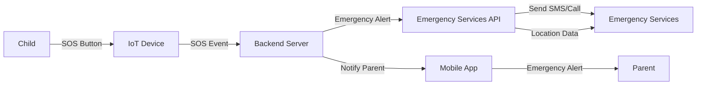

