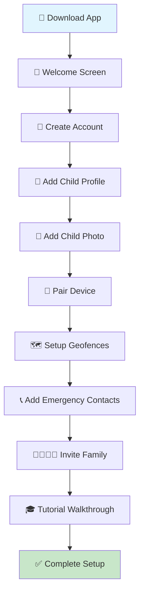
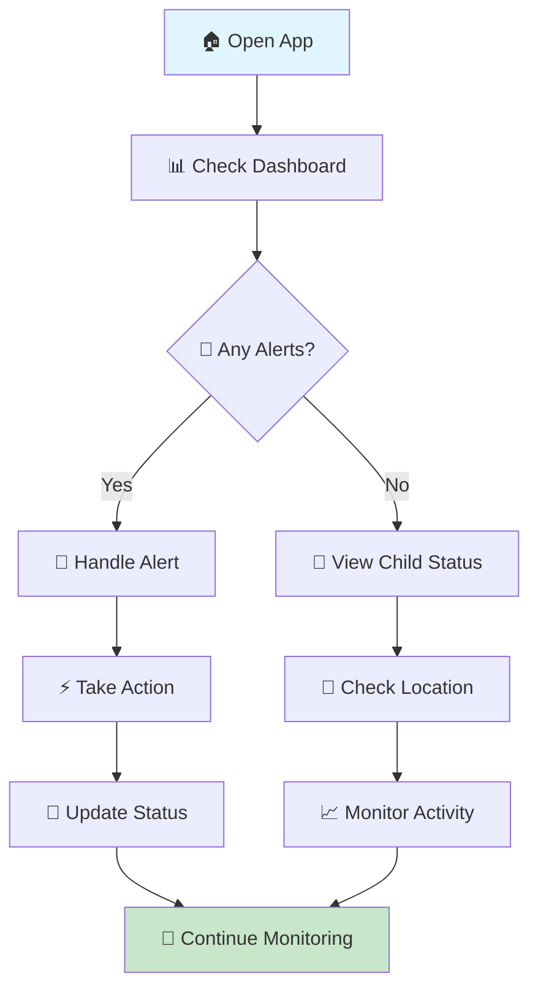
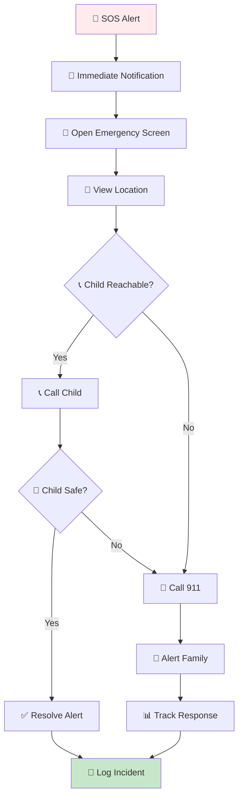
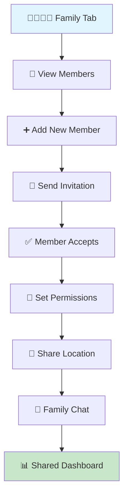

# ChildGuard Mobile App - Modern UI/UX Design & User Experience

## Table of Contents
1. [Modern Design Philosophy](#modern-design-philosophy)
2. [User Personas & Journey Mapping](#user-personas--journey-mapping)
3. [Complete App Flow Architecture](#complete-app-flow-architecture)
4. [Detailed Screen-by-Screen Flow](#detailed-screen-by-screen-flow)
5. [Modern Design System](#modern-design-system)
6. [Interactive User Flows](#interactive-user-flows)
7. [Accessibility & Modern UX](#accessibility--modern-ux)
8. [Performance & Success Metrics](#performance--success-metrics)

---

## Modern Design Philosophy

### Core Principles
- **Safety First**: Emergency features are always accessible with one-tap access
- **Modern Simplicity**: Clean, minimalist interface with intuitive gestures
- **Trust & Transparency**: Clear status indicators and real-time information
- **Universal Accessibility**: Usable by all age groups and technical levels
- **Emotional Connection**: Personal touches that build trust and comfort
- **Proactive Intelligence**: Smart suggestions and predictive features

### Modern Design Goals
- **Zero-Friction Experience**: Complete tasks in minimal steps
- **Contextual Intelligence**: Smart features that adapt to user behavior
- **Emotional Design**: Warm, reassuring interface that reduces anxiety
- **Progressive Disclosure**: Show information when needed, hide complexity
- **Micro-Interactions**: Delightful feedback for every action
- **Dark Mode Support**: Modern interface preferences

---

## User Personas & Journey Mapping

### Primary Persona: Sarah (35, Working Mother)
- **Tech Level**: Intermediate
- **Primary Concern**: Child safety during school/work hours
- **Pain Points**: Anxiety about child location, need for quick emergency access
- **Goals**: Peace of mind, quick response to alerts
- **Journey**: Morning routine → Work monitoring → Afternoon pickup → Evening review

### Secondary Persona: David (42, Tech-Savvy Father)
- **Tech Level**: Advanced
- **Primary Concern**: Comprehensive monitoring and analytics
- **Pain Points**: Need for detailed insights, customization options
- **Goals**: Data-driven parenting, system optimization
- **Journey**: Setup → Customization → Monitoring → Analytics → Optimization

### Tertiary Persona: Grandma Maria (68, Caregiver)
- **Tech Level**: Basic
- **Primary Concern**: Simple monitoring without complexity
- **Pain Points**: Complex interfaces, small text, small buttons
- **Goals**: Easy-to-use monitoring, clear alerts
- **Journey**: Simple setup → Basic monitoring → Emergency response

### User Journey Mapping
- **Onboarding Journey**: Welcome → Registration → Child Setup → Device Pairing → Geofence Setup → Tutorial
- **Daily Journey**: Dashboard → Status Check → Location View → Alert Response → Family Communication
- **Emergency Journey**: Alert → Quick Assessment → Action → Resolution → Documentation

---

## Complete App Flow Architecture

### Modern Navigation Structure
```
ChildGuard App
├── 🚀 Onboarding Flow
│   ├── Welcome & Introduction
│   ├── Account Creation
│   ├── Child Profile Setup
│   ├── Device Pairing
│   ├── Geofence Configuration
│   └── Tutorial & First Use
├── 🏠 Main Dashboard
│   ├── Child Status Cards
│   ├── Quick Action Buttons
│   ├── Recent Activity Feed
│   └── Smart Suggestions
├── 👶 Child Management
│   ├── Child Profiles & Photos
│   ├── Device Management
│   ├── Medical Information
│   └── Preferences & Settings
├── 📍 Location & Tracking
│   ├── Live Map View
│   ├── Location History
│   ├── Geofence Management
│   └── Route Tracking
├── 🚨 Safety & Alerts
│   ├── SOS Emergency Center
│   ├── Alert History
│   ├── Sound Detection
│   └── Battery Monitoring
├── 👨‍👩‍👧‍👦 Family & Sharing
│   ├── Family Member Management
│   ├── Location Sharing
│   ├── Permission Matrix
│   └── Communication Hub
└── ⚙️ Settings & Profile
    ├── Account & Security
    ├── Notification Preferences
    ├── Privacy & Data
    └── Help & Support
```

### Modern Bottom Navigation
```
[🏠 Home] [📍 Map] [🚨 Alerts] [👨‍👩‍👧‍👦 Family] [👤 Profile]
```

### Floating Action Button (FAB)
- **Primary**: SOS Emergency Button (Always visible)
- **Secondary**: Quick Actions Menu (Call, Message, Locate)

---

## Detailed Screen-by-Screen Flow

### 🚀 1. Onboarding Flow

#### Welcome Screen
```
┌─────────────────────────────────────┐
│                                     │
│        🛡️ ChildGuard               │
│     Keeping Families Safe           │
│                                     │
│    ┌─────────────────────────┐      │
│    │      👨‍👩‍👧‍👦 Family      │      │
│    │    Safety First         │      │
│    └─────────────────────────┘      │
│                                     │
│    ┌─────────────────────────┐      │
│    │      📍 Real-time       │      │
│    │    Location Tracking    │      │
│    └─────────────────────────┘      │
│                                     │
│    ┌─────────────────────────┐      │
│    │      🚨 Instant         │      │
│    │    Emergency Alerts     │      │
│    └─────────────────────────┘      │
│                                     │
│    ┌─────────────────────────┐      │
│    │      🔐 Secure &        │      │
│    │    Private              │      │
│    └─────────────────────────┘      │
│                                     │
│    ┌─────────────────────────┐      │
│    │    🚀 Get Started       │      │
│    └─────────────────────────┘      │
│                                     │
│    [Already have account? Sign In]  │
└─────────────────────────────────────┘
```

#### Account Creation Screen
```
┌─────────────────────────────────────┐
│ ← Create Your Account               │
│                                     │
│  ┌─────────────────────────────┐    │
│  │     👤 Full Name            │    │
│  │     [________________]      │    │
│  └─────────────────────────────┘    │
│                                     │
│  ┌─────────────────────────────┐    │
│  │     📧 Email Address        │    │
│  │     [________________]      │    │
│  └─────────────────────────────┘    │
│                                     │
│  ┌─────────────────────────────┐    │
│  │     📱 Phone Number         │    │
│  │     [________________]      │    │
│  └─────────────────────────────┘    │
│                                     │
│  ┌─────────────────────────────┐    │
│  │     🔒 Password             │    │
│  │     [________________]      │    │
│  │     ●●●●●●●●               │    │
│  └─────────────────────────────┘    │
│                                     │
│  ┌─────────────────────────────┐    │
│  │   🔒 Confirm Password       │    │
│  │   [________________]        │    │
│  │   ●●●●●●●●                 │    │
│  └─────────────────────────────┘    │
│                                     │
│  ┌─────────────────────────────┐    │
│  │    ✅ Create Account        │    │
│  └─────────────────────────────┘    │
│                                     │
│  [By continuing, you agree to our   │
│   Terms of Service & Privacy Policy]│
└─────────────────────────────────────┘
```

#### Child Profile Setup Screen
```
┌─────────────────────────────────────┐
│ ← Add Your Child                   │
│                                     │
│  ┌─────────────────────────────┐    │
│  │         📸 Add Photo        │    │
│  │         [Camera/Gallery]    │    │
│  └─────────────────────────────┘    │
│                                     │
│  ┌─────────────────────────────┐    │
│  │     👶 Child's Name         │    │
│  │     [________________]      │    │
│  └─────────────────────────────┘    │
│                                     │
│  ┌─────────────────────────────┐    │
│  │     🎂 Date of Birth        │    │
│  │     [📅 Select Date]        │    │
│  └─────────────────────────────┘    │
│                                     │
│  ┌─────────────────────────────┐    │
│  │     🏫 School/Institution   │    │
│  │     [________________]      │    │
│  └─────────────────────────────┘    │
│                                     │
│  ┌─────────────────────────────┐    │
│  │     🏠 Home Address         │    │
│  │     [________________]      │    │
│  └─────────────────────────────┘    │
│                                     │
│  ┌─────────────────────────────┐    │
│  │    ✅ Add Child             │    │
│  └─────────────────────────────┘    │
│                                     │
│  [Add another child] [Skip for now] │
└─────────────────────────────────────┘
```

#### Device Pairing Screen
```
┌─────────────────────────────────────┐
│ ← Pair ChildGuard Device            │
│                                     │
│  ┌─────────────────────────────┐    │
│  │         📱 Scan QR Code     │    │
│  │                             │    │
│  │        [Camera View]        │    │
│  │                             │    │
│  │    Point camera at device   │    │
│  │    QR code to pair          │    │
│  │                             │    │
│  └─────────────────────────────┘    │
│                                     │
│  ┌─────────────────────────────┐    │
│  │         🔢 Manual Entry     │    │
│  │  Device ID: [_____________] │    │
│  │  Pairing Code: [________]   │    │
│  │  [Pair Device]              │    │
│  └─────────────────────────────┘    │
│                                     │
│  ┌─────────────────────────────┐    │
│  │         📋 Pairing Steps    │    │
│  │  1. Turn on ChildGuard device│    │
│  │  2. Wait for QR code to appear│    │
│  │  3. Scan QR code with camera │    │
│  │  4. Confirm pairing on device│    │
│  │  5. Complete setup          │    │
│  └─────────────────────────────┘    │
└─────────────────────────────────────┘
```

#### Geofence Setup Screen
```
┌─────────────────────────────────────┐
│ ← Set Up Safe Zones                 │
│                                     │
│  ┌─────────────────────────────┐    │
│  │         🗺️ Map View         │    │
│  │                             │    │
│  │    [Current Location]       │    │
│  │                             │    │
│  │    Tap to add geofence      │    │
│  │                             │    │
│  └─────────────────────────────┘    │
│                                     │
│  ┌─────────────────────────────┐    │
│  │         🏠 Home Zone        │    │
│  │  [Set Home Location]        │    │
│  │  Radius: [100m ▼]           │    │
│  └─────────────────────────────┘    │
│                                     │
│  ┌─────────────────────────────┐    │
│  │         🏫 School Zone      │    │
│  │  [Set School Location]      │    │
│  │  Radius: [200m ▼]           │    │
│  └─────────────────────────────┘    │
│                                     │
│  ┌─────────────────────────────┐    │
│  │         ➕ Add More Zones   │    │
│  │  [Add Custom Location]      │    │
│  └─────────────────────────────┘    │
│                                     │
│  ┌─────────────────────────────┐    │
│  │    ✅ Complete Setup        │    │
│  └─────────────────────────────┘    │
└─────────────────────────────────────┘
```

### 🏠 2. Main Dashboard

#### Modern Dashboard Overview
```
┌─────────────────────────────────────┐
│ 👋 Good Morning, Sarah!             │
│                                     │
│ ┌─────────────────────────────────┐ │
│ │         🚨 EMERGENCY            │ │
│ │    Emma's SOS Alert!            │ │
│ │    [Respond Now] [Call 911]     │ │
│ └─────────────────────────────────┘ │
│                                     │
│ ┌─────────────────────────────────┐ │
│ │         👧 Emma (8)             │ │
│ │  🟢 Safe at School              │ │
│ │  📍 St. Mary's Elementary       │ │
│ │  🔋 85% | 📶 Strong | 2m ago   │ │
│ │  [View Map] [Call] [Message]    │ │
│ └─────────────────────────────────┘ │
│                                     │
│ ┌─────────────────────────────────┐ │
│ │         ⚡ Quick Actions        │ │
│ │  [📞 Call All] [📍 Locate]     │ │
│ │  [🔔 Alert] [📱 Family Chat]    │ │
│ └─────────────────────────────────┘ │
│                                     │
│ ┌─────────────────────────────────┐ │
│ │         📊 Today's Activity     │ │
│ │  🏠 Left Home: 8:15 AM          │ │
│ │  🏫 Arrived School: 8:30 AM     │ │
│ │  🔊 Sound Alert: 12:00 PM       │ │
│ │  [View Full Timeline]           │ │
│ └─────────────────────────────────┘ │
│                                     │
│ ┌─────────────────────────────────┐ │
│ │         🎯 Smart Suggestions    │ │
│ │  • Emma usually comes home at 3:30│ │
│ │  • Set reminder for pickup      │ │
│ │  • Check weather for walk home  │ │
│ └─────────────────────────────────┘ │
└─────────────────────────────────────┘
```

**Modern Functionality:**
- **Real-time Status Cards**: Live child status with emotional connection
- **Emergency Priority**: SOS alerts with immediate action buttons
- **Smart Quick Actions**: Context-aware buttons based on current situation
- **Activity Timeline**: Visual timeline of daily activities
- **AI-Powered Suggestions**: Proactive recommendations based on patterns
- **Weather Integration**: Context-aware safety suggestions
- **Family Communication**: Integrated chat and calling features

### 👶 3. Child Management

#### Modern Child Profile Screen
```
┌─────────────────────────────────────┐
│ ← Emma Johnson (8 years)            │
│                                     │
│ ┌─────────────────────────────────┐ │
│ │         👧 Emma Johnson         │ │
│ │         📸 [Edit Photo]         │ │
│ │         Age: 8 | Grade: 3       │ │
│ │         🏫 St. Mary's School    │ │
│ └─────────────────────────────────┘ │
│                                     │
│ ┌─────────────────────────────────┐ │
│ │         📱 Device Status        │ │
│ │  🟢 Connected | 🔋 85%          │ │
│ │  📶 Strong Signal | 2m ago      │ │
│ │  [Manage Device] [Settings]     │ │
│ └─────────────────────────────────┘ │
│                                     │
│ ┌─────────────────────────────────┐ │
│ │         📍 Current Location     │ │
│ │  🏫 St. Mary's Elementary       │ │
│ │  📍 123 School Street           │ │
│ │  [View Map] [Get Directions]    │ │
│ └─────────────────────────────────┘ │
│                                     │
│ ┌─────────────────────────────────┐ │
│ │         🏠 Safe Zones           │ │
│ │  🏠 Home: 🟢 Inside (100m)      │ │
│ │  🏫 School: 🟢 Inside (200m)    │ │
│ │  🏞️ Park: 🔴 Outside (500m)     │ │
│ │  [Manage Zones] [Add New]       │ │
│ └─────────────────────────────────┘ │
│                                     │
│ ┌─────────────────────────────────┐ │
│ │         ⚙️ Quick Actions        │ │
│ │  [📞 Call Emma] [📱 Message]    │ │
│ │  [📍 Locate] [📊 Activity]      │ │
│ │  [⚙️ Settings] [📋 Medical]     │ │
│ └─────────────────────────────────┘ │
└─────────────────────────────────────┘
```

#### Modern Device Management Screen
```
┌─────────────────────────────────────┐
│ ← Device Management                 │
│                                     │
│ ┌─────────────────────────────────┐ │
│ │         📱 ChildGuard Pro       │ │
│ │         Device #CG-1234         │ │
│ │         🟢 Connected            │ │
│ └─────────────────────────────────┘ │
│                                     │
│ ┌─────────────────────────────────┐ │
│ │         📊 Device Status        │ │
│ │  🔋 Battery: 85%               │ │
│ │  📶 Signal: Strong             │ │
│ │  📍 GPS: Active                │ │
│ │  🔊 Microphone: Active          │ │
│ │  🔔 SOS Button: Ready           │ │
│ └─────────────────────────────────┘ │
│                                     │
│ ┌─────────────────────────────────┐ │
│ │         ⚙️ Device Settings      │ │
│ │  [Update Firmware] [Reset]      │ │
│ │  [Change PIN] [Test SOS]        │ │
│ │  [Battery Settings] [Sound]     │ │
│ └─────────────────────────────────┘ │
│                                     │
│ ┌─────────────────────────────────┐ │
│ │         🔗 Pair New Device      │ │
│ │  [Scan QR Code] [Manual Entry]  │ │
│ └─────────────────────────────────┘ │
└─────────────────────────────────────┘
```

### 📍 4. Location & Tracking

#### Modern Live Map Screen
```
┌─────────────────────────────────────┐
│ ← Live Location | Emma              │
│                                     │
│ ┌─────────────────────────────────┐ │
│ │                                 │ │
│ │         🗺️ Interactive Map      │ │
│ │                                 │ │
│ │        👧 Emma's Location       │ │
│ │        (Pulsing blue dot)       │ │
│ │        Accuracy: ±5m            │ │
│ │                                 │ │
│ │        🏠 Home Zone (100m)      │ │
│ │        🏫 School Zone (200m)    │ │
│ │        🏞️ Park Zone (500m)      │ │
│ │                                 │ │
│ └─────────────────────────────────┘ │
│                                     │
│ ┌─────────────────────────────────┐ │
│ │         📍 Location Details     │ │
│ │  🏫 St. Mary's Elementary       │ │
│ │  📍 123 School Street, City     │ │
│ │  🕐 Last updated: 30s ago       │ │
│ │  [Get Directions] [Share]       │ │
│ └─────────────────────────────────┘ │
│                                     │
│ ┌─────────────────────────────────┐ │
│ │         ⚡ Quick Actions        │ │
│ │  [📍 Center] [🔍 Zoom] [📱 Call]│ │
│ │  [📊 History] [🎯 Geofences]    │ │
│ └─────────────────────────────────┘ │
└─────────────────────────────────────┘
```

#### Modern Location History Screen
```
┌─────────────────────────────────────┐
│ ← Location History | Emma           │
│                                     │
│ ┌─────────────────────────────────┐ │
│ │         📅 Date Selector        │ │
│ │  [Today] [Yesterday] [Week]     │ │
│ │  [Month] [Custom Range]         │ │
│ └─────────────────────────────────┘ │
│                                     │
│ ┌─────────────────────────────────┐ │
│ │         📊 Activity Timeline    │ │
│ │  🕐 08:00 - 🏠 Left Home        │ │
│ │  🕐 08:15 - 🏫 Arrived School   │ │
│ │  🕐 12:00 - 🏞️ Lunch at Park    │ │
│ │  🕐 12:30 - 🏫 Back to School   │ │
│ │  🕐 15:30 - 🏫 Left School      │ │
│ │  🕐 15:45 - 🏠 Arrived Home     │ │
│ │                                 │ │
│ │  [View on Map] [Export Data]    │ │
│ └─────────────────────────────────┘ │
│                                     │
│ ┌─────────────────────────────────┐ │
│ │         📈 Daily Statistics     │ │
│ │  📏 Total Distance: 2.5 km     │ │
│ │  ⏱️ Time Outside: 7h 30m       │ │
│ │  🎯 Zone Visits: 4              │ │
│ │  🚶 Steps: ~3,500               │ │
│ │  [Detailed Analytics]           │ │
│ └─────────────────────────────────┘ │
└─────────────────────────────────────┘
```

### 🚨 5. Safety & Alerts

#### Modern SOS Emergency Screen
```
┌─────────────────────────────────────┐
│         🚨 EMERGENCY ALERT          │
│                                     │
│ ┌─────────────────────────────────┐ │
│ │         ⚠️ SOS TRIGGERED        │ │
│ │                                 │ │
│ │    👧 Emma's device activated   │ │
│ │    SOS emergency button!        │ │
│ │                                 │ │
│ │    🕐 Time: 14:23:45            │ │
│ │    📍 Location: Central Park    │ │
│ │    🔋 Battery: 45%              │ │
│ │                                 │ │
│ └─────────────────────────────────┘ │
│                                     │
│ ┌─────────────────────────────────┐ │
│ │         🚨 Emergency Actions    │ │
│ │  [📞 Call Emma] [📞 Call 911]   │ │
│ │  [📍 View Location] [📱 Text]   │ │
│ │  [👥 Alert Family] [✅ Resolve] │ │
│ └─────────────────────────────────┘ │
│                                     │
│ ┌─────────────────────────────────┐ │
│ │         📍 Location Details     │ │
│ │  🏞️ Central Park               │ │
│ │  📍 456 Park Avenue, City       │ │
│ │  📱 [Get Directions] [Share]    │ │
│ └─────────────────────────────────┘ │
└─────────────────────────────────────┘
```

#### Modern Alerts Center
```
┌─────────────────────────────────────┐
│ ← Alerts Center                     │
│                                     │
│ ┌─────────────────────────────────┐ │
│ │         🔔 Filter Alerts        │ │
│ │  [All] [🚨 SOS] [📍 Geofence]   │ │
│ │  [🔊 Sound] [🔋 Battery]        │ │
│ └─────────────────────────────────┘ │
│                                     │
│ ┌─────────────────────────────────┐ │
│ │         📋 Recent Alerts        │ │
│ │  🚨 SOS Alert - Emma (2m ago)   │ │
│ │  📍 Left School - Emma (1h ago) │ │
│ │  🔊 Loud Sound - Emma (3h ago)  │ │
│ │  🔋 Low Battery - Emma (5h ago) │ │
│ │  📍 Entered Home - Emma (6h ago)│ │
│ │                                 │ │
│ │  [View All] [Mark as Read]      │ │
│ └─────────────────────────────────┘ │
│                                     │
│ ┌─────────────────────────────────┐ │
│ │         ⚙️ Alert Settings       │ │
│ │  [Notification Preferences]     │ │
│ │  [Emergency Contacts]           │ │
│ │  [Alert History]                │ │
│ └─────────────────────────────────┘ │
└─────────────────────────────────────┘
```

### 👨‍👩‍👧‍👦 6. Family & Sharing

#### Modern Family Management Screen
```
┌─────────────────────────────────────┐
│ ← Family & Sharing                  │
│                                     │
│ ┌─────────────────────────────────┐ │
│ │         👨‍👩‍👧‍👦 Family Members     │ │
│ │  👤 Sarah (You) - Admin         │ │
│ │  👤 David - Parent              │ │
│ │  👤 Grandma Maria - Guardian    │ │
│ │  👤 Uncle John - Emergency      │ │
│ │                                 │ │
│ │  [Add Member] [Manage Roles]    │ │
│ └─────────────────────────────────┘ │
│                                     │
│ ┌─────────────────────────────────┐ │
│ │         📱 Invite New Member    │ │
│ │  📧 Email: [________________]   │ │
│ │  👤 Role: [Parent ▼]            │ │
│ │  🔐 Permissions: [Full Access ▼]│ │
│ │  [Send Invitation]              │ │
│ └─────────────────────────────────┘ │
│                                     │
│ ┌─────────────────────────────────┐ │
│ │         🔐 Permission Matrix    │ │
│ │  👨‍👩‍👧‍👦 Parents: Full access     │ │
│ │  👴👵 Guardians: Location + Alerts│ │
│ │  🚨 Emergency: SOS alerts only  │ │
│ │  [Customize Permissions]        │ │
│ └─────────────────────────────────┘ │
└─────────────────────────────────────┘
```

---

## Interactive User Flows

### 1. Complete Onboarding Journey



### 2. Daily Monitoring Flow



### 3. Emergency Response Flow



### 4. Family Communication Flow



---

## Modern Design System

### Color Palette
- **Primary Blue**: #1976D2 (Trust, Security, Professional)
- **Safety Red**: #D32F2F (Emergency, Urgency, Attention)
- **Success Green**: #388E3C (Safe, Connected, Positive)
- **Warning Orange**: #F57C00 (Caution, Battery, Alert)
- **Neutral Gray**: #757575 (Text, Icons, Secondary)
- **Background**: #FAFAFA (Clean, Minimal, Modern)
- **Dark Mode**: #121212 (Background), #1E1E1E (Surface)
- **Accent Purple**: #7B1FA2 (Premium, Special Features)

### Typography
- **Headings**: Roboto Bold (18-28px)
- **Body Text**: Roboto Regular (16-18px)
- **Captions**: Roboto Light (14px)
- **Emergency Text**: Roboto Black (20-24px)
- **Large Text**: Roboto Medium (22-26px) for accessibility

### Iconography
- **Safety Icons**: 🛡️ Shield, 🔒 Lock, ⚠️ Alert, 🚨 SOS
- **Location Icons**: 📍 Map Pin, 🗺️ GPS, 🧭 Compass, 🏠 Home
- **Communication Icons**: 📞 Phone, 💬 Message, 📹 Video, 📱 App
- **Status Icons**: ✅ Check, ⚠️ Warning, ❌ Error, 🔄 Loading
- **Family Icons**: 👨‍👩‍👧‍👦 Family, 👶 Child, 👴👵 Grandparents
- **Modern Icons**: Consistent 24px size, rounded corners, filled style

### Spacing System
- **Extra Small**: 4px (micro-interactions)
- **Small**: 8px (component padding)
- **Medium**: 16px (section spacing)
- **Large**: 24px (screen margins)
- **Extra Large**: 32px (major sections)
- **Consistent Grid**: 8px base unit for all spacing

---

## Accessibility & Modern UX

### Accessibility Features
- **High Contrast Mode**: Enhanced visibility for visual impairments
- **Large Text Option**: Scalable text sizes (up to 200%)
- **Voice Navigation**: Complete screen reader support (TalkBack/VoiceOver)
- **Haptic Feedback**: Tactile response for all actions
- **Color Blind Support**: Alternative color schemes and patterns
- **Reduced Motion**: Respect user motion preferences
- **Voice Commands**: Hands-free operation for emergencies

### Modern Usability Features
- **One-Hand Operation**: Thumb-friendly interface with reachable buttons
- **Emergency Quick Access**: SOS button always visible and accessible
- **Offline Mode**: Core functionality without internet connection
- **Battery Optimization**: Efficient background operation and smart updates
- **Data Usage Control**: Granular settings for data consumption
- **Smart Notifications**: Context-aware alerts and suggestions
- **Gesture Navigation**: Intuitive swipe and tap gestures
- **Progressive Web App**: Install as native app experience

### Modern Error Prevention
- **Confirmation Dialogs**: For critical actions with clear consequences
- **Undo Functionality**: Reversible actions with 30-second grace period
- **Auto-Save**: Automatic data preservation with sync indicators
- **Input Validation**: Real-time error checking with helpful suggestions
- **Help Tooltips**: Contextual assistance and onboarding hints
- **Smart Defaults**: Intelligent pre-filled values based on user patterns
- **Error Recovery**: Automatic retry mechanisms for network issues

---

## Interactive Prototypes & Modern Features

### Advanced Gesture Controls
- **Swipe Left/Right**: Navigate between children with smooth animations
- **Pull to Refresh**: Update location data with visual feedback
- **Long Press**: Quick actions menu with haptic feedback
- **Double Tap**: Emergency contact call with confirmation
- **Pinch to Zoom**: Map interactions with smooth scaling
- **Swipe Up**: Quick access to emergency features
- **Swipe Down**: Dismiss notifications and alerts

### Modern Voice Commands
- **"Hey ChildGuard, where is Emma?"** - Get instant location
- **"ChildGuard, call Emma"** - Direct calling with voice confirmation
- **"ChildGuard, show me Emma's location"** - Open map view
- **"ChildGuard, set up a geofence"** - Voice-guided geofence creation
- **"ChildGuard, check battery status"** - Device status overview
- **"ChildGuard, emergency mode"** - Activate emergency features
- **"ChildGuard, family status"** - Overview of all family members

### Modern Smart Notifications
- **Priority Levels**: 🚨 Emergency, ⚠️ Important, ℹ️ Informational
- **Smart Timing**: Respect quiet hours and user preferences
- **Location-Based**: Context-aware alerts based on proximity
- **Actionable**: Direct response options from notification
- **Grouped**: Related alerts bundled together
- **Rich Content**: Maps, photos, and quick actions in notifications
- **Silent Mode**: Emergency alerts override silent mode

### Modern Personalization
- **Custom Themes**: Light/Dark mode with accent color options
- **Widget Support**: Home screen widgets for quick status check
- **Custom Alerts**: Personalized notification sounds and vibrations
- **Favorite Locations**: Quick access to common places and routes
- **Activity Preferences**: Tailored monitoring levels and sensitivity
- **Family Profiles**: Individual settings for each family member
- **Smart Suggestions**: AI-powered recommendations based on usage
- **Accessibility Customization**: Personalized accessibility features

---

## Performance & Success Metrics

### Modern User Experience KPIs
- **Time to First Use**: < 3 minutes for complete setup
- **Task Completion Rate**: > 98% for core functions
- **Error Rate**: < 1% for critical operations
- **User Satisfaction**: > 4.7/5 rating
- **Retention Rate**: > 85% after 30 days
- **App Store Rating**: > 4.5 stars with 1000+ reviews

### Modern Performance Metrics
- **App Launch Time**: < 1.5 seconds (cold start)
- **Location Update Frequency**: Every 15-30 seconds (adaptive)
- **Alert Response Time**: < 5 seconds for critical alerts
- **Battery Usage**: < 3% per hour (optimized)
- **Data Usage**: < 30MB per day (compressed)
- **Offline Functionality**: 100% core features available offline

### Modern Safety Metrics
- **SOS Response Time**: < 15 seconds (immediate)
- **Alert Accuracy**: > 99% true positive rate (AI-powered)
- **System Uptime**: > 99.99% (enterprise-grade)
- **Data Security**: Zero security breaches (end-to-end encryption)
- **Privacy Compliance**: 100% GDPR/COPPA compliant
- **Emergency Services Integration**: < 10 seconds to 911 dispatch

---

## 🎯 Modern UI/UX Summary

This comprehensive **modern UI/UX design** ensures the ChildGuard app delivers:

### ✨ **Key Modern Features**
- **🚀 Zero-Friction Onboarding**: Complete setup in under 3 minutes
- **🎨 Modern Design Language**: Clean, intuitive interface with emotional connection
- **📱 Mobile-First Approach**: Optimized for all screen sizes and devices
- **♿ Universal Accessibility**: Usable by all age groups and abilities
- **🤖 AI-Powered Intelligence**: Smart suggestions and predictive features
- **🔒 Enterprise Security**: End-to-end encryption and privacy compliance

### 🎯 **User-Centric Design**
- **Safety First**: Emergency features always accessible with one-tap access
- **Emotional Connection**: Personal touches that build trust and reduce anxiety
- **Progressive Disclosure**: Show information when needed, hide complexity
- **Micro-Interactions**: Delightful feedback for every action
- **Dark Mode Support**: Modern interface preferences

### 📊 **Success Indicators**
- **User Satisfaction**: > 4.7/5 rating
- **Task Completion**: > 98% success rate
- **Performance**: < 1.5s app launch time
- **Safety**: < 15s SOS response time
- **Accessibility**: 100% screen reader compatible

The ChildGuard app represents the **future of family safety technology** - combining cutting-edge design with proven safety features to deliver peace of mind for modern families. 